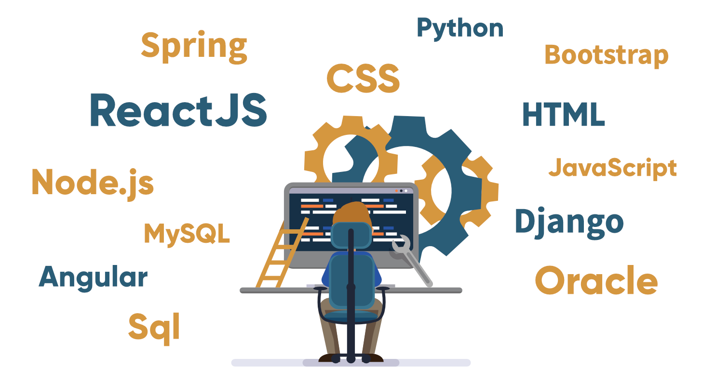

# Mastering The Art Of Web Development

### Best hands-on learning web development resource: [freecodecamp.org](https://www.freecodecamp.org/learn), [scrimba.com](https://scrimba.com/allcourses)
:bangbang: Courses where **no organization name** is specified, means that the videos are from **youtube**  
:bangbang: Courses on **Scrimba** are recommended  
:bangbang: :moneybag: indicates course is **paid** 
## Table of contents
* [Intro](#INTRO)
* [Git](#Git)
* [HTML](#HTML)
* [CSS](#CSS)
* [Javascript](#JAVASCRIPT)
* [Html,css and javascript all in one courses](#HTML-CSS-AND-JAVASCRIPT)
* [SASS](#SASS)
* [Bootstrap](#BOOTSTRAP)
* [Front-end playgrounds](#FRONT-END-PLAYGROUNDS)
* [Javascript frameworks (React,Angular and Vue)](#JAVASCRIPT-FRAMEWORKS)
* [SQL](#sql)
* [Back-end frameworks (Django,Express js,spring boot)](#BACK-END-FRAMEWORKS)
* [Deploy](#deploy)

## INTRO
* [How does the INTERNET work?](https://www.youtube.com/watch?v=x3c1ih2NJEg)
* [How websites work](https://www.youtube.com/watch?v=2rsI05vBsD4)
* [Frontend vs Backend vs Fullstack Web Development](https://www.youtube.com/watch?v=pkdgVYehiTE)
* [How The Backend Works](https://www.youtube.com/watch?v=4r6WdaY3SOA)
* [Dynamic Websites vs Static Pages vs Single Page Apps](https://www.youtube.com/watch?v=Kg0Q_YaQ3Gk)
* [Web Developer vs Web Designer](https://www.youtube.com/watch?v=bDtxF7qSofg)
* [What is HTTP and Why Web Is Built On It?](https://www.youtube.com/watch?v=4_-KdOLZWLs)
* [What is HTTPS](https://www.youtube.com/watch?v=earzZpX-PiY)
* [What is an API?](https://www.youtube.com/watch?v=s7wmiS2mSXY)
* [Domains and the Domain Name System](https://www.youtube.com/watch?v=ip0JSUgU4os)
* [Difference between cookies, session and tokens](https://www.youtube.com/watch?v=44c1t_cKylo&t=408s)
* [Top 5 Code Editors for Web Developers in 2019](https://www.youtube.com/watch?v=4EyhVSAr7Xw)
* [10 Best Visual Studio Code Extensions for Web Development](https://www.youtube.com/watch?v=XEddZ3CCHew)  
* **[Back to table of contents](#Table-of-contents)**

## GIT
  **What is Git?**  
  Git is a distributed version-control system for tracking changes in source code during software development.It is designed for coordinating work among programmers, but it can be used to track changes in any set of files. Its goals include speed, data integrity, and support for distributed, non-linear workflows  
   
  **What is Github?**  
GitHub is a website and cloud-based service that helps developers store and manage their code, as well as track and control changes to their code.
* [Introduction to Git and GitHub (coursera)](https://www.coursera.org/learn/introduction-git-github):moneybag:
* [Git Tutorial | What is Git? | Github](https://www.youtube.com/watch?v=OdbBmvfThJY&t=345s) :arrow_right: [Git and GitHub for Beginners - Crash Course](https://www.youtube.com/watch?v=RGOj5yH7evk&t=335s)
* [Learn Git (codeacademy)](https://www.codecademy.com/learn/learn-git)
* [Install Git on windows](https://www.atlassian.com/git/tutorials/install-git#windows)
* [Install Git on linux](https://www.atlassian.com/git/tutorials/install-git#linux)
* [Git cheat sheet](https://education.github.com/git-cheat-sheet-education.pdf)
* [Hands on Git](https://try.github.io/)
* [Github Alternatives](https://www.tecmint.com/github-alternatives-to-host-open-source-projects/)  
* **[Back to table of contents](#Table-of-contents)**

## HTML
HTML (HyperText Markup Language) is the most basic building block of the Web. It defines the meaning and structure of web content.
* [Introduction to HTML (scrimba)](https://scrimba.com/learn/html)
* [Introduction to HTML5 (coursera)](https://www.coursera.org/learn/html):moneybag:
* [Learn HTML (codeacademy)](https://www.codecademy.com/learn/learn-html)
* [HTML tutorial (w3schools)](https://www.w3schools.com/html/)
* [HTML Full course](https://www.youtube.com/watch?v=pQN-pnXPaVg&list=RDCMUC8butISFwT-Wl7EV0hUK0BQ&start_radio=1&t=181)
* [Documentation](https://developer.mozilla.org/en-US/docs/Web/HTML)
* **[Back to table of contents](#Table-of-contents)**

## CSS
CSS is the language we use to style an HTML document. CSS describes how HTML elements should be displayed.
* [Intro to css (scrimba)](https://scrimba.com/learn/introtocss) :arrow_right: [css grid (scrimba)](https://scrimba.com/learn/R8PTE)
* [Learn css (codeacademy)](https://www.codecademy.com/learn/learn-css)
* [Intro to css](https://www.youtube.com/playlist?list=PLLAZ4kZ9dFpNO7ScZFr-WTmtcBY3AN1M7)
* [Introduction to css3 (coursera)](https://www.coursera.org/learn/introcss):moneybag:
* [CSS Tutorial (w3schools)](https://www.w3schools.com/css/)
* [Learn css animations](https://scrimba.com/learn/cssanimations)
* [Documentation](https://developer.mozilla.org/en-US/docs/Web/CSS)
* **[Back to table of contents](#Table-of-contents)**

## JAVASCRIPT
JavaScript (JS) is a lightweight, interpreted, or just-in-time compiled programming language with first-class functions. 
* [Intro to javascript  (scrimba)](https://scrimba.com/learn/introtojavascript) :arrow_right: [Modern javascript (scrimba)](https://scrimba.com/learn/es6)
* [Learn to Program in Javascript: Beginner to Pro (udemy)](https://www.udemy.com/course/programming-in-javascript/):moneybag:
* [Intro to javascript (codeacademy)](https://www.codecademy.com/learn/introduction-to-javascript)
* [JavaScript Tutorial (w3schools)](https://www.w3schools.com/js/default.asp)
* [JavaScript Promises](https://www.youtube.com/watch?v=DHvZLI7Db8E)
* [JavaScript Async Await](https://www.youtube.com/watch?v=V_Kr9OSfDeU)
* [Javascript Dom Manipulation](https://www.youtube.com/watch?v=wiozYyXQEVk)
* [Vanilla javascipt project](https://www.youtube.com/watch?v=3PHXvlpOkf4)
* [jQuery Tutorial For Beginners](https://www.youtube.com/watch?v=2OMzGhlIZpg)
* [Build a Netflix Landing Page Clone with HTML, CSS & JS](https://www.youtube.com/watch?v=P7t13SGytRk&t=259s)
* [REST API concepts and examples](https://www.youtube.com/watch?v=7YcW25PHnAA)
* [Fetch API & Rendering Data with JavaScript](https://www.youtube.com/watch?v=FN_ffvw_ksE)
* [Build A Weather App](https://www.youtube.com/watch?v=wPElVpR1rwA&t=655s)
* [What is JWT](https://www.youtube.com/watch?v=soGRyl9ztjI)
* [Documentation](https://developer.mozilla.org/en-US/docs/Web/JavaScript)
* **[Back to table of contents](#Table-of-contents)**

## HTML CSS AND JAVASCRIPT 
* [HTML, CSS, and Javascript for Web Developers (coursera)](https://www.coursera.org/learn/html-css-javascript-for-web-developers):moneybag:
* [Web Design for Everybody: Basics of Web Development & Coding Specialization](https://www.coursera.org/specializations/web-design):moneybag:
* [The Complete 2020 Web Development Bootcamp](https://www.udemy.com/course/the-complete-web-development-bootcamp/):moneybag:
* **[Back to table of contents](#Table-of-contents)**

## FRONT-END PLAYGROUNDS
* [codepen](https://codepen.io/)
* [jsfiddle](https://jsfiddle.net/)
* **[Back to table of contents](#Table-of-contents)**

## BOOTSTRAP
Bootstrap is a free and open-source CSS framework directed at responsive, mobile-first front-end web development. It contains CSS- and JavaScript-based design templates for typography, forms, buttons, navigation, and other interface components.
* [Documentationn](https://getbootstrap.com/docs/4.5/getting-started/introduction/)
* [Learn bootstrap (scrimba)](https://scrimba.com/learn/bootstrap4)
* [Complete Bootstrap 4 course - build 3 projects (udemy)](https://www.udemy.com/course/bootstrap-4-tutorials/):moneybag:
* [Learn bootsrap (codeacademy)](https://www.codecademy.com/learn/learn-bootstrap)
* **[Back to table of contents](#Table-of-contents)**

## SASS
Sass is a CSS pre-processor.
Sass reduces repetition of CSS and therefore saves time.
* [Documentation](https://sass-lang.com/documentation)
* [Sass Tutorial for Beginners](https://www.youtube.com/watch?v=_a5j7KoflTs&t=7s)
* [Sass Crash Course](https://www.youtube.com/watch?v=nu5mdN2JIwM)
* [Learn Sass (codeacademy)](https://www.codecademy.com/learn/learn-sass)
* [Sass Tutorial (w3schools)](https://www.w3schools.com/sass/)
* **[Back to table of contents](#Table-of-contents)**

## JAVASCRIPT FRAMEWORKS
* [Angular vs React vs Vue (video)](https://www.youtube.com/watch?v=lYWYWyX04JI)
* [React](#react)
* [Angular](#angular)
* [Vue](#vue)
* **[Back to table of contents](#Table-of-contents)**

## React
React is an open-source, front end, JavaScript library for building user interfaces or UI components. It is maintained by Facebook and a community of individual developers and companies. 
* [The React Bootcamp (scrimba)](https://scrimba.com/learn/react) :arrow_right: [Learn React Hooks (scrimba)](https://scrimba.com/learn/reacthooks)
* [Learn React (scrimba)](https://scrimba.com/learn/learnreact)
* [Front-End Web Development with React (coursera)](https://www.coursera.org/learn/front-end-react):moneybag:
* [Modern React with Redux (udemy)](https://www.udemy.com/course/react-redux/):moneybag:
* [React JS Crash Course](https://www.youtube.com/watch?v=sBws8MSXN7A)
* [Building a chat app with React and Chatkit (scrimba)](https://scrimba.com/learn/reactchatkit)
* [Build a COVID-19 Tracker Application - React JS Project (Hooks, Material UI, Charts js)](https://www.youtube.com/watch?v=khJlrj3Y6Ls)
* [10 React Starter Project Ideas to Get You Coding](https://medium.com/@dtkatz/10-react-starter-project-ideas-to-get-you-coding-5b35782e1831)
* [Docs](https://reactjs.org/docs/getting-started.html)
* **[Back to table of contents](#Table-of-contents)**

## Angular
AngularJS is a JavaScript-based open-source front-end web framework mainly maintained by Google and by a community of individuals and corporations to address many of the challenges encountered in developing single-page applications.
* [Build your first Angular app (scrimba)](https://scrimba.com/learn/yourfirstangularapp)
* [Front-End JavaScript Frameworks: Angular (cousera)](https://www.coursera.org/learn/angular):moneybag:
* [Angular - The Complete Guide (udemy)](https://www.udemy.com/course/the-complete-guide-to-angular-2/):moneybag:
* [AngularJS Tutorials](https://www.youtube.com/playlist?list=PL4cUxeGkcC9gsJS5QgFT2IvWIX78dV3_v)
* [Angular Crash Course](https://www.youtube.com/watch?v=Fdf5aTYRW0E)
* [Corona Covid-19 Cases Tracker](https://www.youtube.com/watch?v=hPJMa1A-VNg)
* [Create Angular Project from Scratch](https://www.youtube.com/watch?v=pTec1e8oyc8)
* [Docs](https://angular.io/docs)
* **[Back to table of contents](#Table-of-contents)**

## Vue
Vue.js is an open-source model–view–viewmodel front end JavaScript framework for building user interfaces and single-page applications. It was created by Evan You, and is maintained by him and the rest of the active core team members coming from various companies such as Netlify and Netguru.
* [The Vue Bootcamp (scrimba)](https://scrimba.com/learn/vue)
* [Learn Vue.js (scrimba)](https://scrimba.com/learn/learnvue)
* [Vue - The Complete Guide (udemy)](https://www.udemy.com/course/vuejs-2-the-complete-guide/):moneybag:
* [Learn Vue.js](https://www.youtube.com/watch?v=4deVCNJq3qc)
* [Vue JS Crash Course](https://www.youtube.com/watch?v=Wy9q22isx3U)
* [Learn Vuetify (scrimba)](https://scrimba.com/learn/vuetify)
* [Create an Hour Tracking App](https://www.youtube.com/watch?v=ZcsCoTPPMD8)
* [Docs](https://vuejs.org/v2/api/)
* **[Back to table of contents](#Table-of-contents)**

## SQL
SQL is a domain-specific language used in programming and designed for managing data held in a relational database management system, or for stream processing in a relational data stream management system.
* [SQL vs NoSQL](https://www.youtube.com/watch?v=ruz-vK8IesE)
* [The Complete SQL Bootcamp 2020: Go from Zero to Hero (udemy)](https://www.udemy.com/course/the-complete-sql-bootcamp/):moneybag:
* [SQL Tutorial](https://www.youtube.com/playlist?list=PLLAZ4kZ9dFpMGXTKXsBM_ZNpJwowfsP49)
* [Learn SQL (w3schools)](https://www.w3schools.com/sql/)
* **[Back to table of contents](#Table-of-contents)**

## BACK-END FRAMEWORKS
* [Best backend frameworks](https://www.keycdn.com/blog/best-backend-frameworks)
* [Django Vs Flask](https://www.youtube.com/watch?v=OZ3K4fK9cAQ)
* [Django (pyhon)](#django)
* [MEAN vs MERN (watch before starting node)](https://www.youtube.com/watch?v=Yxe0EjpVP_I)
* [Node and Express js (MERN,MEAN) (javascript)](#express-js)
* [Spring Boot(java)](#spring-boot)
* **[Back to table of contents](#Table-of-contents)**

## Django
Django is a Python-based free and open-source web framework that follows the model-template-views architectural pattern. It is maintained by the Django Software Foundation, an American independent organization established as a 501 non-profit.
* [Django for Everybody Specialization (coursera)](https://www.coursera.org/specializations/django):moneybag:
* [Django Masterclass : Build Web Apps With Python & Django (udemy)](https://www.udemy.com/course/django-course/):moneybag:
* [Python Django Web Framework](https://www.youtube.com/watch?v=F5mRW0jo-U4)
* [Django Project Ideas](https://data-flair.training/blogs/django-project-ideas/)
* [How to Build an E-commerce Website](https://www.youtube.com/watch?v=YZvRrldjf1Y&t=1s)
* [Django REST Framework Full Course For Beginners](https://www.youtube.com/watch?v=B38aDwUpcFc)
* [Create a Twitter-like App with Python Django JavaScript and React](https://www.youtube.com/watch?v=f1R_bykXHGE)
* [How to Work with AJAX in Django](https://www.pluralsight.com/guides/work-with-ajax-django)
* [Django search filter with Ajax](https://openfolder.sh/django-tutorial-as-you-type-search-with-ajax)
* [Upload multiple images to a post in Django](https://medium.com/@qasimalbaqali/upload-multiple-images-to-a-post-in-django-ff10f66e8f7a)
* [Docs](https://docs.djangoproject.com/en/3.1/)
* **[Back to table of contents](#Table-of-contents)**

## Express JS
Express.js, or simply Express, is a back end web application framework for Node.js, released as free and open-source software under the MIT License. It is designed for building web applications and APIs. It has been called the de facto standard server framework for Node js.
* [Server-side Development with NodeJS, Express and MongoDB (coursera)](https://www.coursera.org/learn/server-side-nodejs):moneybag:
* [Full-Stack Web Development (coursera)](https://www.coursera.org/specializations/full-stack-react):moneybag:
* [Express.js Node.js & MongoDB (coursera)](https://www.udemy.com/course/expressjs-node-mongodb/):moneybag:
* [MERN Stack Front To Back: Full Stack React, Redux & Node.js (udemy)](https://www.udemy.com/course/mern-stack-front-to-back/):moneybag:
* [Angular & NodeJS - The MEAN Stack Guide (udemy)](https://www.udemy.com/course/angular-2-and-nodejs-the-practical-guide/)
* [Express JS Crash Course](https://www.youtube.com/watch?v=L72fhGm1tfE)
* [Learn the MERN Stack](https://www.youtube.com/watch?v=7CqJlxBYj-M&t=1392s)
* [Build a Whatsapp Clone with MERN Stack (MongoDB, Express, React, Node JS)](https://www.youtube.com/watch?v=gzdQDxzW2Tw)
* [MEAN Stack Tutorial](https://www.youtube.com/watch?v=E-GA9GKJWuE)
* [Docs](https://expressjs.com/en/4x/api.html)
* **[Back to table of contents](#Table-of-contents)**

## Spring Boot
The Spring Framework is an application framework and inversion of control container for the Java platform. The framework's core features can be used by any Java application, but there are extensions for building web applications on top of the Java EE platform.
* [Maven Tutorial for Beginners](https://www.youtube.com/watch?v=x8sMN4tossY)
* [Hibernate Tutorial](https://www.youtube.com/watch?v=JR7-EdxDSf0)
* [Spring & Hibernate for Beginners (includes Spring Boot) (udemy)](https://www.udemy.com/course/spring-hibernate-tutorial/):moneybag:
* [Spring Boot Tutorials](https://www.youtube.com/watch?v=35EQXmHKZYs)
* [Spring Boot Java Tutorial - REST API using PostgreSQL and JWT](https://www.youtube.com/watch?v=5VUjP1wMqoE)
* [Docs](https://docs.spring.io/spring-framework/docs/current/spring-framework-reference/)
* **[Back to table of contents](#Table-of-contents)**

## Deploy
* [Host a static website for FREE on GitHub](https://www.youtube.com/watch?v=M5mg0r4ajt4)
* [GitHub Pages Deploy & Domain (React)](https://www.youtube.com/watch?v=SKXkC4SqtRk&t=2s)
* [Deploy An Angular App To Firebase](https://www.youtube.com/watch?v=mF7FTWHS3ys)
* [Deploy a Django App to Heroku](https://www.youtube.com/watch?v=GMbVzl_aLxM)
* [How to deploy a MERN Stack App to Heroku](https://www.youtube.com/watch?v=5PaUiPyBDJY)
* [Running Spring Boot Application on Heroku](https://www.youtube.com/watch?v=KDK5xXPJVIg)
* [Full Node.js Deployment - NGINX, SSL With Lets Encrypt](https://www.youtube.com/watch?v=oykl1Ih9pMg)
* **[Back to table of contents](#Table-of-contents)**
